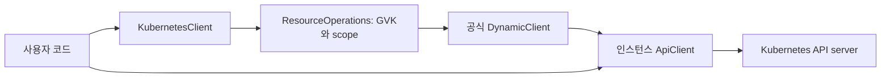

# 표준 high-level interface 설계안 v1

상태: 독립 리뷰 제출안. 구현 완료나 사용자 승인으로 해석하지 않는다.
현재 동작은 [현재 설계](01-current-design.md), 공식 근거는
[sources.md](sources.md)를 따른다. 최종 변경 판단은
[최종 구현계획](04-final-implementation-plan.md)에 반영한다.

## 요구와 범위

확정 요구는 기존 사용방식을 표준화하고 공식 `kubernetes/python`을 기반으로
최신 Kubernetes resource를 쉽게 관리하는 high-level 설계를 완성하는 것이다.
이번 작업은 설계·구현안·독립 리뷰·최종 계획 작성까지다.

제안 범위는 동기 Python API, builtin과 CRD의 일반 객체 CRUD·SSA·watch,
자주 쓰는 Namespace·Secret·ServiceAccount 편의 기능과 workload 대기다.
CLI, controller/reconcile loop, async facade, Helm, exec/attach/port-forward,
다중 문서 일괄 배포·rollback은 기본 설계에 넣지 않는다. 공식 SDK로 직접
호출할 수 있으며 필요가 확인된 기능만 이후 확장한다.

가정은 별도 소비자 코드가 저장소 밖에 있고 즉시 일괄 이관할 수 없다는 것이다.
외부 사용량이나 중단 허용 여부는 확인되지 않았다. 기존 0.9 API를 보존한 채
새 API를 추가하고 새 사용자 문서는 새 방식으로 통일하는 이관을 제안한다.

## SDK 기준과 최신 리소스 지원의 의미

2026-09-27 조회 시 Kubernetes 안정 릴리스는 1.37.0, Python SDK 안정판은
36.0.3, 1.37 대응 SDK 사전 릴리스는 37.0.0b1이다. 기본 의존성은 안정판
36 계열로 두며 37 prerelease는 별도 검증 lane으로 다룬다. SDK 37 GA를
확인한 뒤 테스트와 패키지 범위를 함께 갱신한다. 달력만으로 GA를 추정하지 않는다.

지원은 다음을 구분한다.

| 범위 | 제공 방식 | 보장 조건 |
| --- | --- | --- |
| SDK에 있는 모델·API | 원본 SDK import와 `client.api_client` 사용 | 설치한 SDK 버전의 기능 범위 |
| 서버가 제공하는 builtin/CRD | 공식 `DynamicClient` discovery와 manifest | served GVK, 지원 verb, 사용자 RBAC, 서버 feature gate |
| 새 필드 | dict manifest 입력·dict 응답 | 서버 schema와 admission 검증; SDK 모델로 역변환하지 않음 |
| 준비 완료 | 명시한 workload별 predicate | 대상 generation·UID·상태를 검사한 경우 |

discovery는 서버에서 제공하는 GVK와 resource plural·scope·verb를 확인한다.
클라이언트가 모든 최신 field의 의미를 알고 검증한다는 뜻은 아니다.
사라진 API를 자동으로 다른 version으로 바꾸거나 alpha/beta를 자동 선택하지 않는다.

## 구조와 책임

새 공개 진입점은 `KubernetesClient`다. `KubernetesManager`는 기존 API로
유지한다. 새 facade는 composition을 사용하며 SDK 모델을 새로 생성·복제하지
않는다. resource별 메서드를 문자열 조합으로 generated API에 연결하지 않는다.



`KubernetesClient`는 설정, 소유한 `ApiClient`, lazy `DynamicClient`,
기본 namespace와 field manager를 가진다. `ResourceOperations`는 GVK,
discovered resource, namespace 선택과 공통 작업을 맡는다. client close
후에는 HTTP 요청 전에 closed 상태 오류를 낸다.

dynamic discovery의 기본 cache 파일은 host 기반 임시 파일이므로 여러 인증
인스턴스가 공유할 수 있다. facade는 인스턴스별 `TemporaryDirectory` 안의
cache 파일을 명시한다. 객체별 cache와 임시 디렉터리는 facade가 종료한다.
클러스터 버전·resource 결과를 전역으로 저장하지 않는다.

현재 요구에는 별도 port/interface 계층, plugin registry, 코드 생성기,
SDK fork, database, background thread가 필요하지 않다.

## 인증과 수명

설정 선택은 factory 이름으로 드러낸다.

```python
from kubernetes_client import KubernetesClient

with KubernetesClient.from_kubeconfig(
    config_file="/path/to/kubeconfig",
    context="dev",
    default_namespace="demo",
) as client:
    namespace = client.namespaces.get("demo")
```

`from_kubeconfig(config_file=None, context=None, persist_config=False, ...)`,
`from_kubeconfig_dict(config_dict, context=None, ...)`, `from_incluster(...)`,
`from_configuration(configuration, ...)`, `from_api_client(api_client, ...)`
를 제공한다. 기본 생성자는 API client를 받는 경로로 제한하고 인증을 자동
추측하지 않는다. 연결 factory는 전용 `Configuration`에 SDK loader로
설정을 넣고 `ApiClient(configuration)`을 직접 전달한다. 전역
`Configuration.set_default`를 호출하지 않는다.

`from_configuration`은 복사한 설정으로 새 연결을 소유한다.
`from_api_client`는 빌린 연결이며 `close()`가 외부 ApiClient를 닫지 않는다.
내부 stream과 discovery cache는 두 경로 모두 종료한다. close는 idempotent다.
설정 실패를 다른 credential로 fallback하거나 빈 client로 만들지 않는다.
token 갱신, CA, exec credential 처리는 SDK에 맡긴다. raw host 인증은 SDK
`Configuration`을 직접 만들며 SSL verification 기본값을 유지한다.

## 리소스 선택과 namespace

정규 진입점은 `client.resource(api_version, kind, *, namespace=...)`다.
GVK를 정확히 지정하고 plural을 추측하지 않는다. `client.pods`,
`client.namespaces`, `client.secrets`, `client.service_accounts`,
`client.deployments`, `client.services`, `client.config_maps`, `client.jobs`,
`client.cron_jobs`는 명시적인 안정 GVK에 연결된 편의 속성이다.
새 이름을 매 릴리스마다 추가해야 일반 resource 관리가 가능해지는 구조는 아니다.

```python
pods = client.resource("v1", "Pod", namespace="demo")
pods.get("worker")
claims = client.resource("resource.k8s.io/v1", "ResourceClaim")
claims.list()
inference = client.resource("serving.kserve.io/v1beta1", "InferenceService")
```

CRD 예제의 GVK는 설치된 CRD가 실제로 제공할 때만 유효하다. Gateway API,
KServe, Tekton은 Kubernetes builtin으로 취급하지 않는다.

namespace 생략과 명시를 내부 sentinel로 구분한다. namespaced write의 선택
순서는 명시적으로 bind한 namespace, body의 `metadata.namespace`, client의
`default_namespace="default"`다. explicit bind와 body가 다르면 요청 전에
오류를 낸다. 생략된 body namespace만 복사본에 보충한다. get/delete는
bind 또는 client default를 쓴다. cluster-scoped resource는 명시 namespace와
body namespace를 거부한다. cluster resource에 client default는 적용하지 않는다.

`list(all_namespaces=True)`와 `watch(all_namespaces=True)`만 전체 namespace
조회가 가능하다. explicit namespace와 조합하면 오류다. 쓰기·get/delete는
전체 namespace 옵션을 받지 않는다. 빈 namespace와 `None`은 전체 namespace의
별칭이 아니며 invalid input으로 거부한다.

요청 전 resource discovery를 해결한다. 없으면 `ResourceNotServedError`,
중복 결과는 `AmbiguousResourceError`, discovery 권한/통신 실패는 원인
예외를 보존한다. 정확한 GVK는 자동 version fallback 없이 사용한다.
CRD 등록·삭제 후 `client.refresh_discovery()`로 갱신한다. lookup miss에서
딱 한 번 cache invalidate 후 재조회하며 실패한 HTTP 요청을 자동 replay하지 않는다.

## 공통 작업의 규칙

응답은 Kubernetes wire key를 쓰는 `dict[str, object]`로 통일한다. 내부
`ResourceInstance`는 `.to_dict()`로 변환하고 unknown fields를 유지한다.
typed model이 필요하면 같은 `ApiClient`로 원래 generated SDK API를 호출한다.

| 메서드 | 의미 | 결과·실패 규칙 |
| --- | --- | --- |
| `get(name)` | 단일 GET | dict; 객체 404는 SDK 예외 |
| `exists(name)` | discovery 후 단일 GET | 객체 404만 False; 나머지는 예외 |
| `list(limit=None, continue_token=None, ...)` | 한 페이지 GET | items와 list metadata를 포함한 원본 dict |
| `iter_items(page_size=500, ...)` | continue token으로 순차 조회 | dict iterator; selector와 RV 조건 유지 |
| `create(body, ...)` | 단일 POST | dict; 409를 upsert로 바꾸지 않음 |
| `patch(name, patch, patch_type="merge", ...)` | 명시한 patch | dict; 기본 JSON Merge Patch |
| `replace(name, body, ...)` | PUT | dict; `metadata.resourceVersion` 필수 |
| `apply(body, field_manager=None, force=False, ...)` | SSA PATCH | dict; 별도 exists/read 분기 없음 |
| `delete(name, ignore_not_found=False, ...)` | 단일 DELETE | `DeleteResult`; 수락과 실제 소멸 분리 |
| `watch(...)` | 지정 조건의 유한 watch stream | context manager로 이벤트 iterator 제공 |

`DeleteResult`는 `action=requested|already_absent`, `response=dict|None`을
가진다. `requested`는 2xx 수락이며 finalizer·grace period 종료를 뜻하지 않는다.
`already_absent`는 ignore 옵션으로 처리한 객체 404뿐이다. UID/RV precondition,
propagation policy와 grace period를 공식 `V1DeleteOptions`로 전달한다.
collection delete는 별도 요구가 없어 제공하지 않는다.

`patch_type`은 merge, json, strategic만 허용하고 content type을 정확히
설정한다. JSON Patch는 배열, 나머지는 mapping이다. CRD에는 strategic
patch를 로컬에서 거부한다. apply는 전용 메서드로만 노출한다.

입력은 dict manifest 또는 설치된 공식 SDK model이다. SDK model에는
`ApiClient.sanitize_for_serialization`을 사용한다. 모델 `.to_dict()`의
snake_case key를 API body로 쓰지 않는다. GVK·name·namespace 충돌은
거부한다. create는 `generateName`만 있는 입력도 허용하고 apply에는 name이
필요하다. partial patch는 GVK가 없어도 되며 있으면 resource와 비교한다.

호출자가 준 dict/model을 수정하지 않는다. dict에서 omitted, explicit null,
빈 mapping/list를 보존한다. typed SDK model은 `None` field 생략 때문에
삭제 의도 표현에 쓰지 않으며 partial patch/SSA에는 dict를 권장한다.
response 전체를 write body로 재사용하도록 안내하지 않는다.

명시 옵션은 label/field selector, resource version, dry run, field validation,
request timeout, pagination, SSA field manager, delete options다.
transport 기본은 connect=5초/read=30초다. 임의 `**kwargs`를 public API로
무제한 전달하지 않으며 지원하지 않는 transport/subresource는 SDK로 호출한다.
dict label selector는 key 정렬 후 equality 문법으로 직렬화한다. set 기반
selector 표현은 문자열 그대로 사용한다.

새 API에서는 SDK `ApiException`과 dynamic subclass를 그대로 전달한다.
host/credential, Secret body나 HTTP Authorization을 wrapper가 출력하지 않는다.
발견 불가·모호한 GVK·invalid input·closed client·wait timeout은 원인을
구분하는 예외로 표시한다. 401·403·409·422·429·5xx와 네트워크 timeout을
미존재·성공으로 바꾸지 않는다. write 자동 retry와 conflict 강제 덮어쓰기는 없다.

## SSA와 편의 기능

SSA는 `DynamicClient.server_side_apply`에 `field_manager`와
`force_conflicts`를 전달한다. client 기본 field manager는
`"kubernetes-client"`이며 앱별로 바꿀 수 있다. apply content type은
`application/apply-patch+yaml`; payload는 JSON-compatible dict다.
force 기본값은 False다. 같은 field manager가 관리하던 field의 생략은
field 제거로 이어질 수 있으므로 partial merge patch와 동일하게 설명하지 않는다.

Namespace helper는 이름·labels·annotations를 담은 최소 manifest를 만든다.
Istio injection과 `runtime/project-id`는 호출자가 넣는 labels이며 새 API의
자동 정책이 아니다. 별도의 프로젝트 policy framework도 도입하지 않는다.

Secret helper는 `.opaque(...)`, `.docker_registry(...)`, `.basic_auth(...)`
로 manifest를 만든다. helper는 클러스터에 쓰지 않는다. 실제 동작은
`secrets.create(...)` 또는 `.apply(...)`로 선택한다. credential이 없으면
`"None"` 문자열로 만들지 않고 입력 오류를 낸다. data는 base64 문자열,
stringData는 평문이라는 원래 API 의미를 유지한다. SSA에는 stringData를
일관된 data로 인코딩한 최소 manifest를 사용한다. data와 stringData의
같은 key가 겹치면 helper는 거부한다. Secret 값은 encode한다고 암호화되지 않는다.

ServiceAccount helper는 metadata와 imagePullSecrets 등의 manifest만 만든다.
자동 long-lived token Secret는 만들지 않는다. TokenRequest·status·scale 등
subresource는 별도 SDK 호출로 시작하며 generic CRUD 대상과 섞지 않는다.

새 수량 helper는 `requests`/`limits`에 Kubernetes quantity 문자열과 임의
resource key를 받으며 공식 `V1ResourceRequirements`를 반환한다. GPU는
NVIDIA 한 종류로 제한하지 않는다. request > limit은 명시적 검증 오류로
처리하고 값을 자동 증가시키지 않는다. 기존 `Spec`와 `build_resource_spec`
동작은 기존 API에만 유지한다. 수량 parsing은 SDK quantity utility를 검토하되
server validation을 대체한다고 주장하지 않는다.

```python
from kubernetes_client.manifests import secret_manifest

client.namespaces.apply({
    "apiVersion": "v1",
    "kind": "Namespace",
    "metadata": {"name": "demo", "labels": {"owner": "team-a"}},
})
credentials = secret_manifest.opaque(
    "credentials", namespace="demo", string_data={"username": "example"},
)
client.secrets.apply(credentials, field_manager="example-app")
client.deployments.apply(deployment_manifest)
client.deployments.wait_ready("api", timeout_seconds=120)
```

`deployment_manifest`는 사용자가 제공한 `apps/v1 Deployment` mapping이다.
이 예제는 제안 API이며 현재 패키지에서는 실행되지 않는다.

## watch와 준비 완료

watch는 library 내부에서 print하지 않는다. 이벤트는
`type`, `object`, `resource_version`을 가진다. object는 원본 dict이며
BOOKMARK도 별도 type으로 유지한다. `resource_version`은 opaque 문자열이다.
지정하지 않으면 현재 이후 변경만 보며 initial snapshot과 무손실 관측을
보장하지 않는다. list의 `metadata.resourceVersion`을 전달하는 사용법을
문서화한다. context manager 종료와 iterator close는 SDK Watch와 response를
닫는다. SDK 직접 watch helper는 request timeout 옵션이 제한되므로
`Watch.stream(resource.get, ...)`를 직접 구성하는 작은 adapter를 둔다.

유한 `timeout_seconds`를 항상 전달해 SDK의 자동 watch retry를 비활성화한다.
410 Gone/ERROR는 예외로 종료한다. caller가 relist·watch 재개 여부를 결정한다.
임의 최신 RV로 바꿔 끊긴 이벤트를 정상 stream처럼 이어 주지 않는다.

`wait_ready`는 Pod와 Deployment에만 제공한다. Pod는 phase Running만으로
성공 처리하지 않고 Ready condition=True를 검사한다. Deployment는
observedGeneration >= 최초 목표 generation, updated/available replica 조건과
진행 실패 condition을 검사한다. generic CRD는 readiness를 추정하지 않는다.

대기는 단일 GET으로 UID/generation/RV를 얻고 같은 객체의 watch를 시작한다.
monotonic deadline으로 network/stream 시간까지 제한한다. 재생성된 UID는
대체 객체를 성공으로 삼지 않고 오류다. 410은 caller에 전달하고 자동 relist는
하지 않는다. `wait_deleted`도 UID 기준으로 삭제 완료와 이름 재사용을 구분한다.
watch stream의 정상 timeout은 wait 성공이 아니며 deadline 전 상태를 확인하고
남은 시간 안에서만 새 요청을 시작한다. workload별 deadline·취소·종료 처리는
공통 stream 수명 규칙을 따른다.

## 리소스 범위와 SDK escape hatch

일반 관리 범위는 Core, apps, batch, autoscaling, networking, policy, RBAC,
storage, discovery, coordination, apiextensions, admissionregistration,
scheduling, certificates, resource 등 서버에서 발견되는 group이다.
group 목록을 runtime allowlist로 만들지 않는다. feature gate나 RBAC로
접근할 수 없는 리소스까지 지원을 선언하지 않는다.

최신 resource는 ResourceClaim/ResourceClaimTemplate/ResourceSlice 같은
`resource.k8s.io/v1` 객체와 서버가 발견시키는 새 GVK로 검증한다. EndpointSlice,
Ingress, CronJob, HPA는 각각 현재 stable GVK를 명시한다. 제거된 beta API와
Endpoints 같은 deprecated 객체는 신규 기본 예제에서 사용하지 않는다.

```python
from kubernetes import client as sdk

apps_api = sdk.AppsV1Api(client.api_client)
scale = apps_api.read_namespaced_deployment_scale("api", "demo")
```

exec/attach는 SDK stream이 transport를 변경할 수 있으므로 facade의 공유
연결을 재사용하도록 권장하지 않는다. 별도로 만든 SDK client의 수명은
사용자가 관리한다.

## 기존 API 이관

기존 import, constructor, `.client`, 메서드 signature·반환·기존 수량 보정은
0.9 계열의 regression 대상으로 유지한다. 새 기능은 `KubernetesClient`에
추가한다. old prepare를 SSA로 내부 치환하지 않는다. SSA field ownership와
create/patch 경합 동작이 다르기 때문이다.

기존 동작을 고치는 작업은 별도 compatibility 검증을 통과한 변경으로 다룬다.
이관 가이드는 create-only, merge patch, SSA, readiness wait의 의미를 명시한다.
즉시 legacy 삭제, import alias로의 단순 치환, 주어진 전역 설정의 소급 변경은
제안하지 않는다. 삭제 시점은 외부 소비자 확인 후 별도 breaking release로 정한다.
